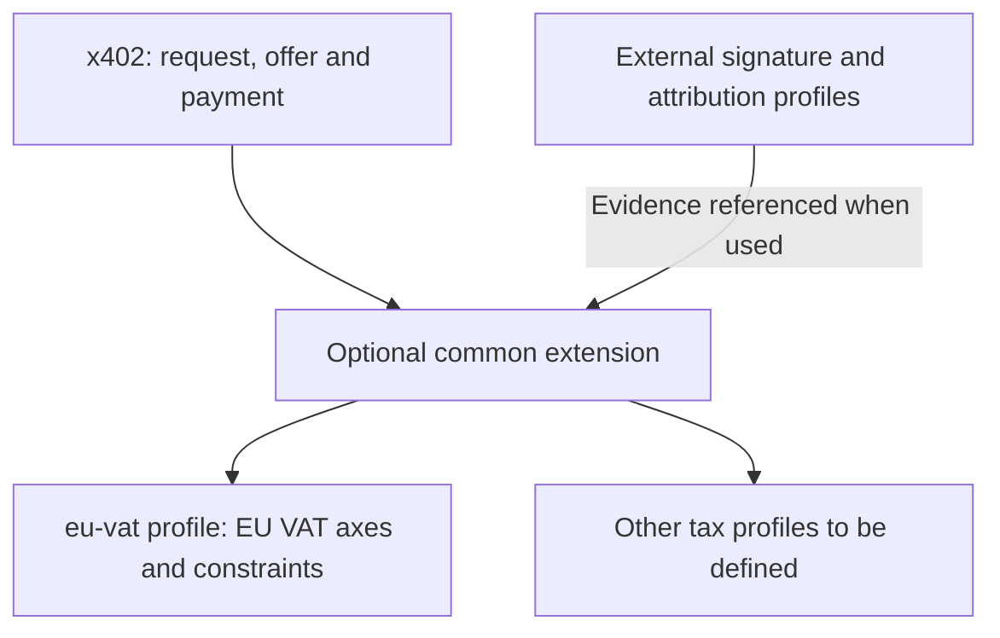
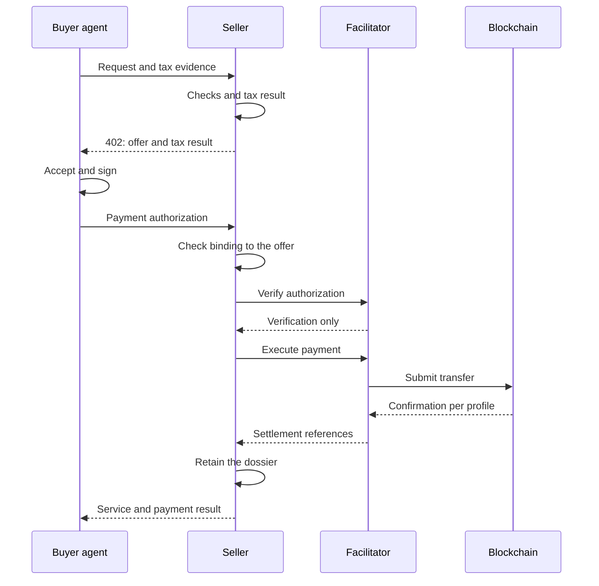
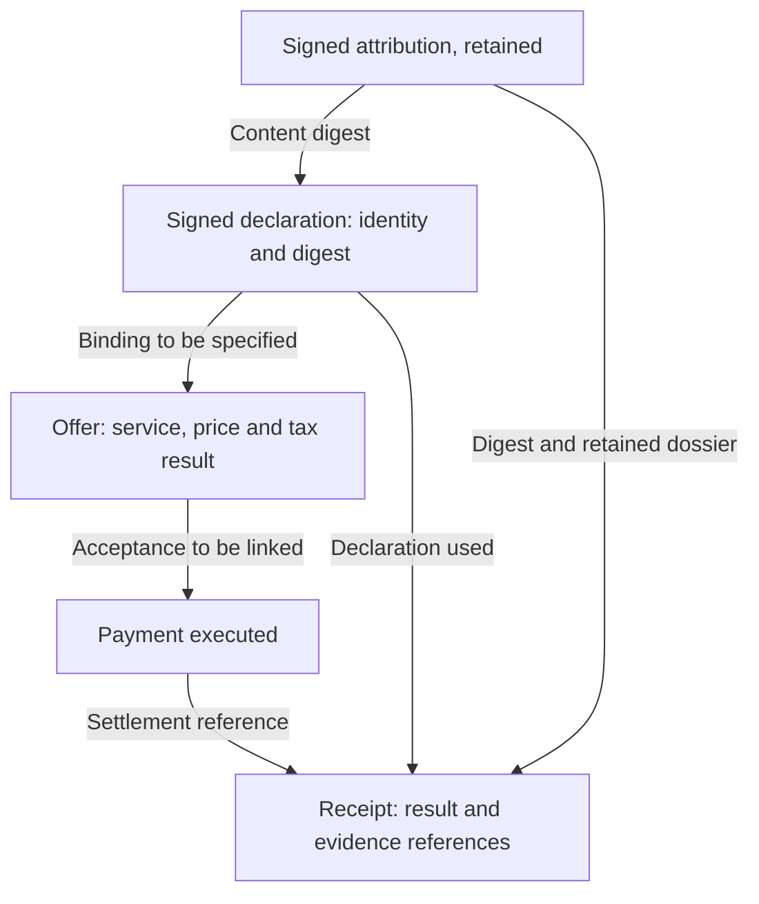

# Buyer-Side Tax Declaration

**Status:** Draft for working group review, revision 3
**Companion to:** PR #4, *Tax Jurisdiction Discovery, Settle-Only Provenance & SCITT Audit Receipts* (@whawk46 / Corrente Labs)
**Scope:** Adds buyer-side qualification. Does not modify settle-only accounting, SCITT registration, or EIP-3009 event derivation.

---

## Abstract

PR #4 lets a resource server advertise **its own** tax jurisdiction and Merchant-of-Record status. For several tax systems, that is not sufficient to determine the applicable treatment, because the treatment also depends on facts about the **buyer**. The seller's establishment, role and scheme remain relevant.

This companion specifies:

1. A **buyer-signed tax declaration**, carried in a dedicated header, signed by the payment key in the proposed EVM/EIP-3009 profile.
2. A **verification model** under which the request in flight never waits for an external register and an upstream outage is never converted into a negative answer. Local signature checks remain required; acceptance is the seller's policy.
3. A **qualification model** separating the treatment applied from the evidence it rests on, with an explicit representation of insufficient information and a fallback procedure to be validated.
4. A **multi-axis tax result**, jurisdiction-scoped, replacing the scalar regime enumeration of revision 1.
5. Additional **receipt fields** preserving the decision context, plus an informative aggregation principle.
6. A **principal attribution model**, recording what the seller knew about the principal behind the signing key, how it is bound to the declaration, and what is retained. Added in revision 3.

### What changed in revision 3

Revision 2 stated that a signature binds a key to a statement, not a natural or legal person, and compared the seller's position to receiving a VAT number from a customer today. Review showed that comparison fails in agent-mediated flows, which are what x402 exists for: the key is typically held by an agent acting for a principal, and neither the declaration nor the receipt represented that second hop.

Revision 3 addresses it without designing a delegation mechanism, which stays out of scope:

- **§2.1** gains two optional fields, `principalId` and `principalAttributionHash`, both covered by the declaration's existing EIP-712 signature. The principal is asserted once per validity window, in the cached declaration, rather than on every settlement, and the attribution used at quote time is bound to the one recorded at settlement.
- **§2.2** is corrected. The declaration binds the controlling key; attribution to a natural or legal person is out of scope for the declaration itself and is handled in §6.6.
- **§6.6** is new. It specifies what is signed and what is hashed when the attribution object carries its own signature; the binding between attribution, declaration and quote; what the receipt carries and what the seller retains; a five-value `principalAttributionStatus` with permitted field combinations; a disclosure rule for `principalId` in transparency receipts; and a worked example. An earlier draft proposed an invariant tying attribution to `qualificationBasis`; it is withdrawn in §6.6.6, with the reason and the cost stated.
- **§0** states the common-contract / first-profile structure explicitly: what is jurisdiction-independent, and what belongs to `eu-vat` only.
- **§4.3** defines `determinationStatus`, the `DETERMINED` and `UNDETERMINED` outputs, and the absence of axes in an incomplete result.
- **§5.3** corrects an invariant that referenced an undefined `buyerStatus`; it now distinguishes a declaration consistency constraint from the substantive qualification still to be specified in the profile.
- **§8.6** is narrowed to what remains open after §6.6. **§8.9** and **§8.10** are added, on `supplierScheme` across jurisdictions and on whether a `NOT_APPLICABLE` status value should exist.

This revision also makes targeted corrections to caching rules (§3), fallback (§4), invariants (§5.3), conversion dates (§6.2) and documentary aggregation (§7). Directions taken from the comments are preserved; unestablished guarantees and undefined interfaces are flagged.

### What changed in revision 2

Revision 1 proposed a single `taxRegime` scalar with seven values. That was wrong, and it failed in the same way as the `rateBasisPoints` scalar this proposal originally objected to: it collapsed distinct facts into one field.

Two real cases proved it, and both are documented in §5.1. The correction is a small set of distinct axes plus normative invariants, not a longer enumeration.

Between revision 1 and revision 2, the declaration, verification and fallback ladder were unchanged. Revision 3 refines them as stated above.

---

## 0. Normative scope

This document standardises **the shape of the tax result exchanged**, so that different resolvers can produce and consume the same contract.

It is structured as a **common contract** and a **first profile**. The common contract covers what is jurisdiction-independent: the declaration, its evidence references, the binding between declaration, quote and result, and the distinction between absence, verification and decision. The first profile, `eu-vat`, covers EU VAT on electronically supplied services: the axes of §5, their invariants, and the worked examples. Obligations marked as belonging to the `eu-vat` profile apply only to implementations of that profile. The common contract does not make the EU profile, nor any particular delegation mechanism, mandatory for every x402 user.

Blocks marked **[EU-VAT]** describe the first tax profile; blocks marked **[EVM]** describe its illustrative technical binding. The presence of a profile, its identifier and its version must be distinguishable in exchanges; their representation and negotiation remain to be defined under §8. The words MUST and MUST NOT express proposed requirements within the scope of the block concerned, without presuming their adoption by the WG.

It does not standardise:

- computation of tax amounts;
- invoice generation or invoice wording;
- execution or filing of any periodic tax return;
- any particular tax engine, rules provider or data source.

**Rationale.** A specification carrying the substantive tax rules of 27 member states would be stale on publication and would make one implementation normative in practice. Standardising the result instead of the reasoning lets an in-house engine, an open-source library and a commercial provider interoperate, none of them being a dependency of the standard.

The material to retain in order to make attribution references verifiable is specified in §6.6. Retention periods and national documentary obligations remain out of scope.

### 0.1 Proposed architecture [INFORMATIVE]

The tax profile complements the common contract; it does not replace the payment steps. A delegation mechanism is required only where the profile and the situation call for it.



---

## 1. Problem statement [EU-VAT]

Under EU VAT rules for electronically supplied services, the applicable treatment depends on facts about the **buyer**: whether they are a taxable person, and in which member state they are established. The seller's establishment and scheme also matter, in particular for franchise regimes and territoriality derogations.

A seller advertising `jur=FR` still cannot decide between:

| Buyer | Possible treatment, subject to applicable conditions |
|---|---|
| Taxable person, another member state | Reverse charge; place of supply in the buyer's state |
| Taxable person, outside the EU | Not due in the EU |
| Non-taxable person, another member state | Buyer's national rate, above threshold or on option |
| Non-taxable person, another member state | Seller's national rate, below threshold |
| Unknown | Insufficient qualification; procedure of §4.3 |

A wallet address does not, by itself, supply the customer's tax status and location. The proposed declaration gives the seller information that a payment alone does not.

---

## 2. The buyer tax declaration

*(revision 3: attribution added, binding clarified, and handling of a missing declaration corrected)*

### 2.1 Structure of the first profile [EU-VAT / EVM]

```json
{
  "version": "x402-tax-1",
  "jurisdiction": "DE",
  "taxableStatus": "TAXABLE_PERSON",
  "taxId": "DE123456789",
  "validUntil": 1790000000000,
  "principalId": "did:pkh:eip155:1:0x1234…",
  "principalAttributionHash": "sha-256:7f83b165…",
  "signature": "0x…"
}
```

| Field | Type | Notes |
|---|---|---|
| `jurisdiction` | ISO 3166-1 alpha-2 | Place of establishment claimed by the buyer |
| `taxableStatus` | `TAXABLE_PERSON` \| `NON_TAXABLE` | Closed enumeration |
| `taxId` | string, optional | Required when `taxableStatus` is `TAXABLE_PERSON` and the jurisdiction issues one |
| `validUntil` | integer, ms | Buyer-set expiry; the seller MAY cache no longer than this |
| `principalId` | string, optional | Identifier of the principal the signing key acts for. MUST be absent when no attribution is supplied. Added in revision 3. |
| `principalAttributionHash` | string, optional | Digest of the principal attribution payload as defined in §6.6.2. MUST be present when `principalId` is present, absent otherwise. Added in revision 3. |
| `signature` | EIP-712 | Over the other fields, including `principalId` and `principalAttributionHash` when present |

### 2.2 Signature and binding [EVM]

In the proposed EVM/EIP-3009 profile, the declaration MUST be signed with the **same key that signs the EIP-3009 payment authorization**. This binds the declaration to the payer without introducing any new identity primitive, reuses the structured-signature principle of the payment profile, and identifies the key behind the assertion. The EIP-712 types, domain and encoding of optional fields for this new declaration remain to be defined.

The declaration does not prove that the signer is the natural or legal person named by `taxId`. It establishes that the **signing key** asserted the declared facts. The signature alone does not prove its time of creation; receipt and use must be observed separately.

Revision 2 compared this to a seller receiving a VAT number from a customer today. That comparison holds only when the key's controller is the counterparty. In agent-mediated flows, which are what x402 exists for, the key is typically held by an agent acting for a principal, and the declaration alone says nothing about that second hop. Attribution to a natural or legal person is therefore out of scope for the declaration itself. What is recorded about it, and how it is bound to this declaration, is specified in §6.6.

### 2.3 Transport

```
X-Tax-Declaration: <base64url(JSON)>
```

Seller-only. It MUST NOT be placed in `resource_url`, `description`, `reason`, or any field that transits a facilitator: those reach third parties in cleartext, and a tax identifier has no reason to be there. The header name is left to the working group.

The declaration is **optional at the protocol level**. Its absence does not guarantee that the seller can accept or qualify the transaction. §4.3 distinguishes insufficient qualification from the seller's acceptance policy.

---

## 3. Verification

*(revision 3: caching, freshness and asynchronous checks refined)*

### 3.1 An upstream outage MUST NOT produce a negative answer

When the competent authority does not respond, the result is `NOT_VERIFIABLE`, never `INVALID`. A missing response and an explicitly negative response do not mean the same thing. The acceptance policy MUST distinguish them.

VIES queries the national registers of the member states; the unavailability of any one of them can prevent a verification without establishing that the identifier is invalid.

### 3.2 Caching and freshness

An identifier check MAY be cached to avoid repeated calls. The pair `(payer address, taxId)` MAY serve as an index, but does not validate every future declaration or mandate carrying those values. The profile MUST specify the jurisdiction, the authority queried, and the other elements that condition reuse of a result.

The seller MAY set a freshness period shorter than `validUntil` and renew a check when relevant information changes. The validity of the declaration, the freshness of the tax check and the validity of the mandate are distinct. An administrative check does not renew an expired signed declaration.

### 3.3 Asynchronous re-verification

The request in flight MUST NOT wait for an external register's response for its tax qualification. The seller uses a still-valid cached result, or records `NOT_VERIFIABLE` and triggers the check asynchronously. This rule also applies to the first call with no cache: no positive result is assumed.

The unavailability of a verification does not by itself determine acceptance of the transaction. The seller applies its acceptance policy to the result produced by the resolver.

The declaration's signature and local consistency checks MUST be verified before it is used as an authenticated declaration. A deferred administrative query does not dispense with these checks. The no-wait constraint applies to the external register; it does not remove local checks.

---

## 4. Qualification [EU-VAT]

### 4.1 Three distinct facts

Revision 1 under-specified this. The following are separate and MUST NOT be conflated:

| Fact | Source |
|---|---|
| Status declared by the buyer | The signed declaration |
| Whether the buyer acts as a taxable person for this supply | Elements relating to this purchase; representation to be defined in the profile |
| Whether the identifier verified | The competent authority |

**A failed verification does not make a professional a consumer.** It affects the evidence, not the status. The current JSON expresses a general status but not explicitly the professional capacity for this purchase; this point remains to be addressed under §8.

This has a concrete and common cause. A French identifier is derivable from the SIREN, but it is **not active by default** for a business under a domestic franchise regime: activation must be requested from the tax office. A buyer under such a regime can therefore supply a structurally valid number in good faith that VIES will reject. Declared status accurate, verification failed.

### 4.2 Two fields, not one

- `taxRegime`: replaced in revision 2 by the multi-axis result of §5
- `qualificationBasis`: what the result rests on:

| Value | Meaning |
|---|---|
| `DECLARED_VERIFIED` | Declared tax identifier checked positively against the competent authority; validates neither all declared facts nor attribution to the principal |
| `DECLARED_UNVERIFIED` | Declaration present, verification unavailable or expired |
| `INFERRED` | No declaration; location established from other evidence |
| `NONE` | No declaration, no evidence |

`qualificationBasis` describes the elements the determination rests on; it does not by itself select the tax treatment. The representation of an explicitly negative check remains to be specified and MUST NOT be confused with unavailability.

### 4.3 Insufficient information and fallback to be validated

Fallback to the standard rate received explicit support in the comments on PR #5. That support is preserved as a direction for discussion; it does not establish that the seller's country rate guarantees the absence of exposure for an unlocated buyer. [whawk46's comment on fallback](https://github.com/x402-foundation/wg-tax/pull/5#issuecomment-5520425817).

| Buyer supplies | Consequence for the determination |
|---|---|
| Verified identifier in another member state | Element for examining B2B treatment, subject to the other conditions |
| Evidence of non-EU establishment | Element for determining the place of supply; no worldwide conclusion on all taxes |
| Sufficiently probative location items | Determination under the applicable rules and any derogations |
| Nothing, or insufficient items | Unresolved qualification; no jurisdiction or rate is automatically inferred from that absence |

The resolver MUST produce a `determinationStatus` field, distinct from `qualificationBasis` and from the tax axes:

| Value | Meaning |
|---|---|
| `DETERMINED` | The resolver has determined the tax treatment; the result contains the axes of §5 and satisfies their constraints. |
| `UNDETERMINED` | The usable elements are insufficient to determine the tax treatment; the axes of §5 are absent. |

When `determinationStatus` is `UNDETERMINED`, the fields `placeOfSupplyJurisdiction`, `placeOfSupplyRule`, `taxTreatment`, `liableParty`, `mechanism`, `supplierScheme` and `exemptionLegalBasis` MUST NOT be emitted, not even with a `null` value. Their absence means neither exemption, nor a zero rate, nor absence of tax due. The attribution fields, where used, remain subject to their own rules in §6.6.

This version does not carry a partial tax result. Elements already known remain available in the declaration and the evidence. The absence of a declaration does not automatically trigger `UNDETERMINED`: other elements may suffice for the determination.

For a request with no declaration and no other sufficient element, the resolver produces:

```yaml
determinationStatus: UNDETERMINED
qualificationBasis: NONE
```

`qualificationBasis` continues to describe the elements available; `NONE` is not imposed on every `UNDETERMINED` result. An identifier may, for example, have been verified without all conditions of the treatment being established.

The decision to accept the request remains distinct from this resolver output. The seller MAY request further elements or apply its acceptance policy in accordance with the applicable rules. This version does not standardise a universal domestic fallback rate. [European Commission: place of taxation](https://taxation-customs.ec.europa.eu/taxation/vat/vat-directive/place-taxation_en).

### 4.4 Pricing as an incentive

A seller who cannot qualify the buyer must provision the worst case, and that provision is real money. The `402` quote MAY differ by qualification level, the higher price applying to `NONE`.

A commercial surcharge for uncertainty is neither a tax determination nor a guarantee of absence of exposure. A later check does not silently alter a price already authorized.

---

## 5. The tax result [EU-VAT]

### 5.1 Why a scalar cannot work

Revision 1 proposed seven mutually exclusive values. Two real cases break it, and both come from the same corner of EU law.

**Case one.** A French supplier under a domestic franchise regime supplies, in another member state, a taxable service falling under the general B2B rule, with no cross-border franchise applicable to that supply. Place of supply is the customer's member state and the customer is liable under Article 196 of the VAT Directive: the supplier's franchise does not prevent the reverse charge. So `supplierScheme` and `mechanism` are independent. Revision 1's `SMALL_BUSINESS` fused them and destroyed the place-of-supply information.

**Case two.** Since Directive 2020/285 took effect in 2025, the cross-border SME exemption is not restricted to non-taxable customers. So `supplierScheme` and the buyer's taxable status are independent too.

Neither case can be expressed by any of the seven values. The failure is structural, not a missing entry.

### 5.2 Axes

| Field | Values |
|---|---|
| `placeOfSupplyJurisdiction` | ISO 3166-1 alpha-2, the **actual** jurisdiction (`DE`, `FR`, `US`) |
| `placeOfSupplyRule` | `B2B_GENERAL`, `B2C_ELECTRONIC`, `SPECIAL` |
| `taxTreatment` | `TAXABLE`, `EXEMPT`, `NOT_DUE_IN_EU` |
| `liableParty` | `SUPPLIER`, `CUSTOMER`, `NONE` |
| `mechanism` | `SUPPLIER_COLLECTION`, `REVERSE_CHARGE`, `NONE` |
| `supplierScheme` | `STANDARD`, `SME_DOMESTIC`, `SME_CROSS_BORDER` |
| `exemptionLegalBasis` | string, `null` unless `taxTreatment` is `EXEMPT` |

Two naming choices are deliberate.

**Actual jurisdiction codes, not relative ones.** Revision 1 used `SUPPLIER_JURISDICTION` and `CUSTOMER_JURISDICTION`. That records which rule produced the answer, not where the supply is taxable. Downstream consumers need the second.

**`NOT_DUE_IN_EU`, not `OUT_OF_SCOPE`.** Where the applicable rules place the supply outside the EU VAT territory, the value indicates that EU VAT is not due. It does not mean no indirect tax exists: a sales tax, GST or foreign VAT may apply in the customer's jurisdiction. The `eu-vat` vocabulary scope makes this explicit rather than implying a global conclusion.

### 5.3 Invariants

The invariants below are normative and mechanically checkable for `DETERMINED` results. A `DETERMINED` result violating any of them MUST be rejected. For an `UNDETERMINED` result, the axes are absent per §4.3; these invariants do not apply.

```
IF   mechanism = REVERSE_CHARGE
THEN liableParty = CUSTOMER

IF   mechanism = REVERSE_CHARGE
     AND a declaration is supplied
THEN declaration.taxableStatus = TAXABLE_PERSON

IF   taxTreatment = EXEMPT
THEN exemptionLegalBasis IS NOT NULL

IF   taxTreatment = NOT_DUE_IN_EU
THEN liableParty = NONE AND mechanism = NONE
```

Invariants are what keeps the closed-vocabulary discipline once the scalar is gone. Without them, a multi-axis result can express combinations that do not exist in law.

The second invariant corrects the reference to an undefined `buyerStatus` and checks the consistency of a declaration where one exists. It does not prove professional capacity for the supply. The profile has still to define the representation of the status retained by the resolver and the elements justifying it, in particular where no declaration is present. The proposed constraints do not amount to an exhaustive validation of the tax treatment.

### 5.4 Worked examples

**EU taxable person, standard supplier**

```yaml
determinationStatus: DETERMINED
placeOfSupplyJurisdiction: DE
placeOfSupplyRule: B2B_GENERAL
taxTreatment: TAXABLE
liableParty: CUSTOMER
mechanism: REVERSE_CHARGE
supplierScheme: STANDARD
qualificationBasis: DECLARED_VERIFIED
```

**EU taxable person, supplier under a domestic franchise**, case one of §5.1

```yaml
determinationStatus: DETERMINED
placeOfSupplyJurisdiction: DE
placeOfSupplyRule: B2B_GENERAL
taxTreatment: TAXABLE
liableParty: CUSTOMER
mechanism: REVERSE_CHARGE
supplierScheme: SME_DOMESTIC
qualificationBasis: DECLARED_VERIFIED
```

The supplier issues no VAT. The customer self-assesses and may deduct that same self-assessed amount subject to its own right of deduction. No VAT is invoiced by the supplier, so none is deductible from the invoice; the deduction arises from the reverse charge itself.

**Supplier under an active cross-border SME exemption in the place of supply**

```yaml
determinationStatus: DETERMINED
placeOfSupplyJurisdiction: DE
placeOfSupplyRule: B2B_GENERAL
taxTreatment: EXEMPT
liableParty: NONE
mechanism: NONE
supplierScheme: SME_CROSS_BORDER
exemptionLegalBasis: "directive-2020-285"
qualificationBasis: DECLARED_VERIFIED
```

No VAT arises, so there is nothing for the customer to self-assess and nothing to deduct.

**Undeclared or insufficiently qualified buyer**

With no declaration and no other sufficient element, the output is `determinationStatus: UNDETERMINED` and `qualificationBasis: NONE`, without the axes of §5. No country, rate or liable party is inferred from that absence alone. Other sufficient elements may allow a determination, even without a declaration.

---

## 6. Receipt fields

### 6.1 Settlement asset

```json
"settlementAsset": "eip155:8453/erc20:0x833589fCD6eDb6E08f4c7C32D4f71b54bdA02913"
```

The same nominal amount settled in USDC and in EURC produces different taxable bases in EUR. A receipt recording only an amount and a currency name is ambiguous once multiple assets are in use.

### 6.2 Exchange rate, frozen and dated

```json
"paymentCurrency": "USDC",
"taxCurrency": "EUR",
"exchangeRate": "0.9187",
"exchangeRateSource": "ecb-daily",
"exchangeRateTimestampMs": 1787806800000
```

The rate retained under the applicable tax method and date is preserved together with the historical computation. Exports MUST reproduce the same computation; a correction is a new referenced entry.

`exchangeRateSource` MUST come from a closed vocabulary. An auditor cannot act on a source each implementer names differently. The profile MUST specify the admitted conversion method and its reference date; chargeable event and chargeability must not be confused.

A USD/EUR reference rate does not by itself define a USDC/EUR conversion. The profile MUST document the valuation method: the direction of the rate, any intermediate conversion, and which tax date is used. A correction creates a new referenced entry; it never rewrites the historical computation.

### 6.3 `null` is not zero

Where no rate is determined or applied by the supplier, the rate field MUST be `null`. `0` is reserved for an actual legal zero rate.

Reverse charge, exemption, an SME regime and non-EU supplies are not a legal 0%. Writing `0` leads a downstream consumer to sum lines of different natures and produce a false total.

### 6.4 Three timestamps

| Field | Meaning |
|---|---|
| `paymentTimestamp` | Settlement confirmation, chain-timestamped |
| `supplyTimestamp` | When the service was actually supplied |
| `taxPoint` | Tax date whose nature and rule are specified by the profile |

These moments MUST NOT be assumed simultaneous. The profile MUST distinguish chargeable event from chargeability where they differ. An observation on the blockchain does not by itself prove receipt of the service by the buyer.

### 6.5 Result fields

In the `eu-vat` profile, `determinationStatus` and `qualificationBasis` belong in the receipt as well as in the quote. For a `DETERMINED` result, the axes of §5 are also retained. For an `UNDETERMINED` result, those axes remain absent per §4.3. The common contract retains the result of the profile used without imposing these axes on every tax system. The receipt is what an audit examines, and the result is what an audit questions.

### 6.6 Principal attribution

This section specifies **what the declaration and the receipt record** about the principal behind the signing key, when, how the two are bound, and what the seller must retain.

It does not specify how a delegation is verified, what format it takes, or how many hops it contains. Those belong to an authorization layer, outside the normative scope of §0. The proposed attribution profile specifies a canonical content and its binding to the signature. Its compatibility with external mechanisms must be defined; it is not presumed for every format.

#### 6.6.1 Principle

The receipt records **what was known at settlement**, not what is true.

The specification never validates an attribution. It records whether one was present, whether it was checked and with what result, and it freezes what is needed to check later the integrity of what was retained. An auditor opening the receipt years later needs to answer one question: what did the seller know, and what did it rely on.

#### 6.6.2 What is signed, and what is hashed

One JSON object can be serialized in several ways that are equivalent to a parser and distinct to a hash function. If the signer signs one serialization and the seller hashes another, the receipt hash no longer proves that the signature covers the values it claims to cover.

A second difficulty precedes that one: the attribution object carries its own signature, and a signature cannot cover content that includes itself. What is signed must therefore be defined precisely.

`principalAttribution` MUST have a defined **unsigned payload**, excluding its own signature field.

In the proposed JCS profile, the digest covers the UTF-8 bytes of that payload's canonical serialization. The signature profile MUST define precisely how the signature commits to those same bytes. An EIP-712 signature covers a typed structure and its encoding; a bare reference to EIP-712 does not define its binding to the JCS bytes. [EIP-712 specification](https://eips.ethereum.org/EIPS/eip-712).

The requirement that signed content and hashed content align comes from review and received explicit agreement. The choice of canonical representation is preserved; its articulation with the various signature schemes remains to be finalised. [minia2auk's proposal](https://github.com/x402-foundation/wg-tax/pull/5#issuecomment-5548632223); [whawk46's agreement](https://github.com/x402-foundation/wg-tax/pull/5#issuecomment-5549576555).

`principalAttributionHash` MUST identify both the digest algorithm and the digest of those canonical bytes. The signature, and the material required to verify it, MUST be retained alongside the payload.

This digest commits to the attribution payload: anyone holding the payload can canonicalize it and check that the digest matches. It does not, by itself, establish signature validity or the signer's authority. Those are verification results, recorded under §6.6.5.

Two boundaries follow. Signatures of delegation hops carried inside the payload are distinct from the payload's own outer signature; the profile MUST define where that boundary lies. And the digest of the unsigned payload does not commit to the verification dossier, meaning the signatures and material the seller relied on. If their historical presence must be provable, the receipt profile MUST carry a separate commitment or evidentiary reference to that dossier.

The digest algorithm and its encoding are to be fixed consistently with the receipts of PR #4.

#### 6.6.3 Binding attribution to the declaration and the quote

Carrying attribution both at quote time and in the receipt is necessary, since the seller needs the principal's identity to decide the treatment and the auditor needs it years later. It is not sufficient: nothing would guarantee the two copies are the same. An agent could present one attribution to obtain a treatment at quote time, and the receipt could record another.

When principal attribution is supplied, the signed tax declaration of §2.1 MUST include the principal identifier in `principalId` and the attribution digest in `principalAttributionHash`. The identifier is what the seller needs to decide; the digest is what binds the decision to a specific attribution object. The seller MUST bind the quote to that declaration and attribution digest. The receipt MUST preserve the same binding for the accepted quote.

A change to the declaration or to the attribution that affects qualification requires a new quote before payment authorization.

Including the digest in the signed declaration ties the payer's assertion to that attribution content. It is not, on its own, sufficient to tie the payment to a specific offer.

A shared attribution digest does not distinguish two different tax declarations issued under the same mandate. The transactional profile MUST therefore define a verifiable binding between the accepted offer, the tax declaration and the payment authorization.

The comments on PR #4 ask for a signed binding between the challenge and the attribution. That direction is preserved, but its realisation must remain compatible with the payment in use. The existing EIP-3009 authorization carries no declaration-digest field; this document does not prescribe altering its signed structure arbitrarily. The exact mechanism remains to be settled with PR #4. [Comment on signed binding](https://github.com/x402-foundation/wg-tax/pull/4#issuecomment-5565862943); [EIP-3009 structure](https://eips.ethereum.org/EIPS/eip-3009).

Consistency checks MUST verify that the identity named in the declaration matches the one in the attribution payload. Caching does not extend the scope, expiry or validity of a mandate; the seller applies the identified policy to the transaction at hand.

The signed attribution object must accompany the declaration, since the seller needs it at quote time. Its transport channel is to be defined on the same principle as §2.3: seller-only, never in a field that transits a facilitator.

#### 6.6.4 What the receipt carries, and what the seller retains

The receipt MAY carry only the attribution digest, not the full object.

Two requirements stated in review pull in opposite directions: keeping wire payloads compact for micro-transactions, an argument made in support of canonical profiles under open question 8.1, and recording the full delegation chain, N hops, each with its own scope, nonce and expiry. The transmission cost of a signed chain must be assessed in micro-transaction flows; no quantified gain is presumed here. The fixed-size digest satisfies compactness. It does not, alone, satisfy the second requirement.

The seller MUST retain, or arrange durable retention of, the exact attribution payload, its signature, and the verification material relied upon, for the applicable retention period.

Retrieval from the original issuer MAY supplement this retention but MUST NOT be its sole guarantee. The issuer may cease to exist, refuse, or have changed.

The digest enables integrity checking of retained evidence. It does not provide evidence availability or reconstruction.

The object may stay out of the receipt. It must not stay out of controlled retention. National retention periods are outside this specification, as are other national particulars.

#### 6.6.5 Receipt fields

| Field | Type | Role |
|---|---|---|
| `principalAttributionStatus` | closed enumeration | State of the attribution at settlement |
| `principalId` | string, `null` if absent | The principal identifier as presented at quote time |
| `principalAttributionHash` | string, `null` if absent | Digest of the unsigned payload, algorithm included, as defined in §6.6.2 |

`principalAttributionStatus` takes one of:

| Value | Meaning |
|---|---|
| `ABSENT` | No attribution accompanied the settlement |
| `NOT_CHECKED` | An attribution was present; the seller did not verify it |
| `VERIFIED` | An identified verifier validated the binding, scope and temporal validity under an identified policy |
| `FAILED` | A verification was performed and concluded negatively |
| `INDETERMINATE` | A verification was performed and could not conclude |

A status rather than a boolean, because present-and-unchecked, present-and-verified and present-and-indeterminate are three different situations with different consequences under audit, and a boolean collapses them.

`NOT_CHECKED` exists because the verification mechanism remains out of scope. This value records the absence of verification honestly without the specification mandating a mechanism. The specification does not conclude that this state is sufficient under applicable law or under the seller's acceptance policy.

A `VERIFIED` status presupposes a policy that checks the links between the payer key, the principal, and the taxable entity named in the declaration. A mandate valid for principal A does not justify use of the tax identifier of B. The retained dossier MUST identify the verifier, the policy applied and the time of the check; the format of those references is for the working group.

Permitted combinations:

| `principalAttributionStatus` | `principalId` | `principalAttributionHash` |
|---|---|---|
| `ABSENT` | `null` | `null` |
| any other value | non-null | non-null |

Any other combination is invalid and MUST be rejected.

On `principalId` and disclosure: a receipt registered with a transparency service is potentially public, and a tax identifier may constitute personal data depending on its holder and the context. The principal identifier MUST be available to the seller for qualification. Its inclusion in any externally disclosed receipt MUST follow the receipt's access-control and disclosure profile. Availability to the seller does not imply public disclosure.

The combination table above describes the full receipt held by the seller. A redacted view intended for a third party MUST be identified as such, and a masked identity MUST NOT be read as `ABSENT`.

#### 6.6.6 Presence, verification, qualification: three distinct facts

An earlier draft of this section proposed an invariant tying the absence of attribution to `qualificationBasis` under reverse charge. It is withdrawn for the following reason.

The decisive difficulty is the case of a buyer acting directly with its own key: the absence of a delegation chain is not sufficient to exclude a valid qualification. The separation between qualification and attribution does not forbid consistency constraints between those fields; it forbids equating their meanings.

In its place:

Successful tax-identifier verification MUST NOT imply verified principal attribution. Attribution presence MUST NOT imply attribution validity. These results MUST be recorded separately: tax qualification in `qualificationBasis`, attribution state in `principalAttributionStatus`.

The distinction between the two checks lies in their definition and in the acceptance policy. Mechanical checks remain possible: co-presence of fields, matching digests, consistency of identifiers and linkage to the evidence used. With the current fields alone, however, `ABSENT` cannot distinguish "no delegation needed" from "attribution not supplied". Open question 8.10 addresses that precise limit.

#### 6.6.7 Worked example

Reverse charge, standard supplier, agent acting for a German taxable person, attribution present and verified.

```yaml
# Declaration, EIP-712 signed by the agent's key
jurisdiction: DE
taxableStatus: TAXABLE_PERSON
taxId: DE123456789
validUntil: 1790000000000
principalId: "did:pkh:eip155:1:0x1234…"
principalAttributionHash: "sha-256:7f83b165…"

# Tax result
determinationStatus: DETERMINED
placeOfSupplyJurisdiction: DE
placeOfSupplyRule: B2B_GENERAL
taxTreatment: TAXABLE
liableParty: CUSTOMER
mechanism: REVERSE_CHARGE
supplierScheme: STANDARD
qualificationBasis: DECLARED_VERIFIED

# Receipt, attribution fields
principalAttributionStatus: VERIFIED
principalId: "did:pkh:eip155:1:0x1234…"
principalAttributionHash: "sha-256:7f83b165…"
```

The digest is identical in the declaration and in the receipt: that is the §6.6.3 binding. The seller retains the full attribution object, its signature and the verification material, outside the receipt.

Same situation, seller not having verified the attribution:

```yaml
principalAttributionStatus: NOT_CHECKED
principalId: "did:pkh:eip155:1:0x1234…"
principalAttributionHash: "sha-256:7f83b165…"
```

The positive check of the identifier remains recorded separately in `qualificationBasis`. This does not mean that reverse charge remains automatically justified without an attribution check: the resolver must take into account all elements and the applicable policy.

#### 6.6.8 Out of scope

The specification does not define or select:

- the format of the attribution chain;
- its verification mechanism, the identity of the verifier, or the verifier's policy;
- the admissible number of hops;
- the cryptographic primitive expressing it;
- national retention periods.

Delegation mechanisms exist, including AP2 mandates, EIP-712 signed envelopes and ERC-4337 user operations, and should be referenced rather than redefined here. The proposed JCS profile defines the digest input; its binding to the selected signature mechanism remains to be finalised. Where a check is performed, its result is recorded in `principalAttributionStatus`. Citing an external mechanism demonstrates neither its compatibility nor the signer's legal authority.

This follows the principle already adopted for tax rulesets: an interoperability specification creates no normative dependency on a particular component.

### 6.7 Purchase flow and evidence [INFORMATIVE]

The flow below illustrates an immediate EVM payment, with an agent aware of the extension and usable elements available before the final offer. On the first call with no cache, the request does not wait for the external register (§3.3); if elements remain insufficient, the resolver produces `UNDETERMINED` (§4.3). Profile negotiation remains to be defined. The enriched tax receipt and any SCITT registration are not assumed public nor automatically included in the HTTP response.



A verified authorization is not a settlement. A confirmed settlement does not prove receipt of the service. Recovery after failure, proof of delivery and refunds are not defined by this diagram. [x402 flow](https://docs.x402.org/core-concepts/client-server).



A digest protects the correspondence of retained content; it does not restore a lost item and does not demonstrate the truth of the declaration. The bindings marked "to be specified" remain WG work.

---

## 7. Documentary aggregation [INFORMATIVE]

SCITT receipts provide a micro-transaction audit trail; they do not automatically discharge an invoicing obligation.

The combination `(declared identity, period, result)` is an informative aggregation basis for downstream applications. It is not a universal invoice key. The application must preserve the buyer identity and treatment specific to each transaction; the number of invoices and the documentary rules remain outside the scope of this standard.

The value of aggregation was confirmed in the exchanges. Moving to an informative rule preserves that objective while respecting §0, which excludes invoice generation. [whawk46's comment](https://github.com/x402-foundation/wg-tax/pull/4#issuecomment-5472749693).

Corrections to retained entries are new entries referencing the original, with no silent rewriting of history.

---

## 8. Open questions

1. **Canonical profiles.** Should recurrent combinations carry stable identifiers (for example `EU_B2B_REVERSE_CHARGE`), and if so are they normative values, normative aliases for field combinations, or conformance test vectors only?
2. **Minimal core.** Which fields are genuinely required for x402 interoperability, and which belong in optional extensions?
3. **Ruleset governance.** If results reference a versioned jurisdiction ruleset, who publishes those identifiers and under what authority? Interoperability cannot rest on identifiers no one maintains, and it must not rest on a proprietary one either.
4. **Evidence level.** What proof should accompany a result produced by a third-party resolver?
5. **Consumer location evidence.** EU rules require non-contradictory items of evidence to locate a non-taxable buyer. A wallet supplies none natively. Either `INFERRED` is not served and those cases fall to the fallback, or the specification must define evidence the protocol does not carry. The procedure must be defined together with §4.3, without automatically equating absence of evidence with the seller's country.
6. **Legal weight of attribution.** §6.6 records whether an attribution was present, whether and how it was checked, and freezes its canonical digest; it does not verify the delegation. Three things remain open: which existing delegation mechanism the WG references, what verifier policy qualifies a `VERIFIED` status, and whether a tax authority accepts a `NOT_CHECKED` attribution as evidence of the seller's good faith. The first two are authorization-layer choices, the third needs input from a tax adviser.
7. **Non-EU seller, EU buyer.** Out of scope of this draft. Flagged because it will be raised.
8. **Merchant of Record.** The entity legally supplying the service, and its relevant establishments, must be identified. Which party produces and owns the result remains to be specified; the MoR label alone does not determine it.
9. **`supplierScheme` across several member states.** A single value cannot represent a supplier under a cross-border SME exemption in one member state and under the standard scheme in another. Whether `supplierScheme` should be scoped per place-of-supply jurisdiction, or whether the result should carry one entry per applicable jurisdiction, is open.
10. **`NOT_APPLICABLE` as an attribution status value.** §6.6.6 drops the attribution invariant because a signer who is itself the principal has nothing to attribute, and `ABSENT` cannot distinguish "nothing to supply" from "not supplied". A sixth value, `NOT_APPLICABLE`, declared by the signer, would restore that distinction and make an invariant possible again. But it would be one more unverified self-declaration, and a dishonest agent would use it to escape attribution. The question is whether regaining mechanical checkability is worth introducing a self-declared field at exactly the point where self-declaration is the problem. I don't recommend it, but the arguments run both ways.
11. **Profiles and interoperability.** How to identify and version the tax profile used in messages, negotiate it, and handle an unsupported profile? How to represent several results where several tax systems are involved?
12. **Cryptographic interfaces.** Fix EIP-712 types and domain, optional fields, digest algorithm and encoding, attribution transport, and the declaration–offer–payment binding. Define JCS/signature compatibility without arbitrarily modifying the EIP-3009 authorization.
13. **Qualification and receipts.** Define professional capacity for the purchase, the status retained by the resolver, and an explicitly negative check. The incomplete output is defined in §4.3 by `determinationStatus: UNDETERMINED`. Specify who assembles and signs the enriched receipt, what stays with the seller, and what is communicated to the facilitator or a transparency service.

---

## 9. Non-goals

- No change to settle-only accounting, SCITT registration, or EIP-3009 event derivation. This companion adds to PR #4; it does not modify its existing pillars.
- No member-state-specific rates, thresholds, filing formats or invoice wording. The mechanism is specified; national particulars are not.
- No reference implementation in this document.
- **Sources and status.** The treatments in §5 rest on primary texts: Article 196 of the VAT Directive, Article 286 ter of the French tax code, Directive 2020/285, and BOFiP §140. This document is written from operating experience with EU VAT filing. It is not tax advice, and the axes and invariants of §5 should be reviewed by a tax adviser before adoption.
