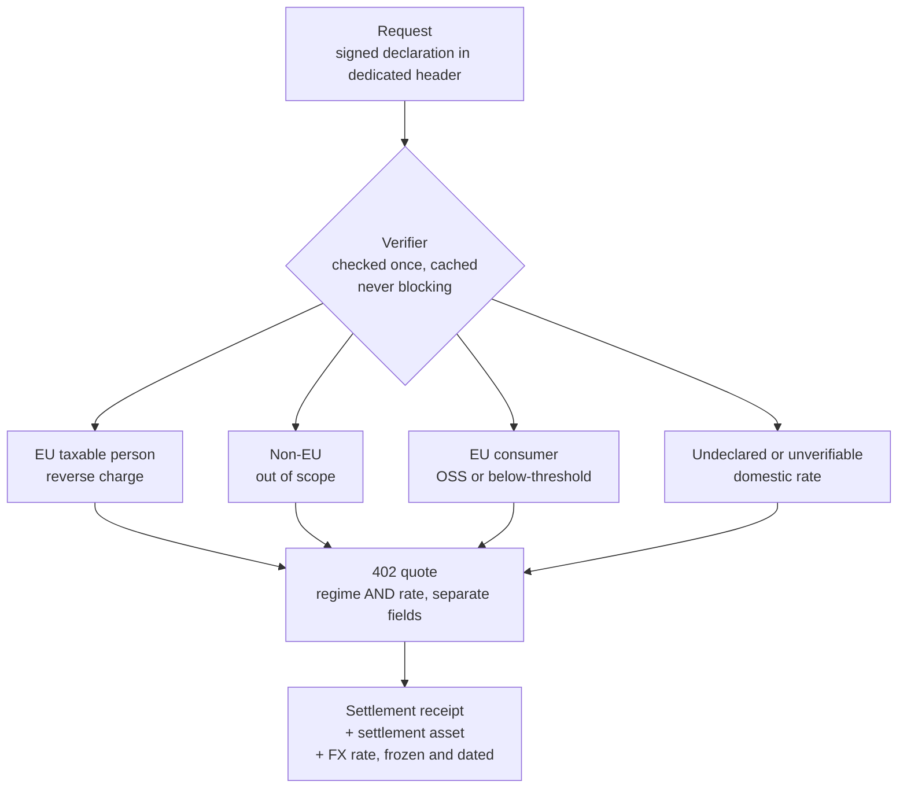

# Buyer-Side Tax Declaration

**Status:** Draft for working group review
**Companion to:** PR #4, *Tax Jurisdiction Discovery, Settle-Only Provenance & SCITT Audit Receipts* (@whawk46 / Corrente Labs)
**Scope:** Adds buyer-side qualification. Does not modify settle-only accounting, SCITT registration, or EIP-3009 event derivation.

---

## Abstract

PR #4 lets a resource server advertise **its own** tax jurisdiction and Merchant-of-Record status. For several tax systems, that is not sufficient to determine the applicable treatment, because the treatment is a function of the **buyer**, not the seller.

This companion specifies:

1. A **buyer-signed tax declaration**, carried in a dedicated header, signed by the same key that signs the EIP-3009 authorization.
2. A **verification model** that never blocks the critical path and never converts an upstream outage into a negative answer.
3. A **qualification model** separating the treatment applied from the evidence it rests on, with an explicit default that leaves no unqualified exposure.
4. A **jurisdiction-prefixed regime vocabulary**, so the mechanism generalises beyond any single tax system.
5. Two additional **receipt fields** and an **aggregation key**, both unrecoverable after the fact.

---

## 1. Problem statement

Under EU VAT rules for electronically supplied services, the applicable treatment depends on two facts about the buyer: whether they are a taxable person, and in which member state they are established. The seller's own establishment determines almost nothing.

A seller advertising `jur=FR` still cannot decide between four different outcomes:

| Buyer | Treatment |
|---|---|
| Taxable person, another member state | Reverse charge, plus a periodic recapitulative statement |
| Taxable person, outside the EU | Outside the scope of EU VAT |
| Non-taxable person, another member state | One-Stop-Shop, at the buyer's national rate |
| Unknown | No defensible position |

x402 is designed so that the seller learns nothing about the buyer. A wallet address is neither a taxable person nor a jurisdiction. This is a deliberate protocol property, and it is precisely what makes the seller's obligation unsatisfiable without an explicit declaration.

---

## 2. The buyer tax declaration

### 2.1 Structure

```json
{
  "version": "x402-tax-1",
  "jurisdiction": "DE",
  "taxableStatus": "TAXABLE_PERSON",
  "taxId": "DE123456789",
  "validUntil": 1790000000000,
  "signature": "0x…"
}
```

| Field | Type | Notes |
|---|---|---|
| `jurisdiction` | ISO 3166-1 alpha-2 | Place of establishment claimed by the buyer |
| `taxableStatus` | `TAXABLE_PERSON` \| `NON_TAXABLE` | Closed enumeration |
| `taxId` | string, optional | Required when `taxableStatus` is `TAXABLE_PERSON` and the jurisdiction issues one |
| `validUntil` | integer, ms | Buyer-set expiry; the seller MAY cache no longer than this |
| `signature` | EIP-712 | Over the other fields |

### 2.2 Signature and binding

The declaration MUST be signed with the **same key that signs the EIP-3009 payment authorization**. This is deliberate and has three consequences:

- It binds the declaration to the payer without introducing any new identity primitive.
- It requires no additional cryptography beyond what x402 already uses: EIP-3009 is already EIP-712 typed data.
- It shifts the burden of the claim to the party making it. The seller holds a signed statement, not an inference.

The declaration does **not** prove that the signer is the legal person named by `taxId`. It establishes that the payer asserted it, under signature, at a given time. That is the same evidentiary position a seller occupies today when a customer supplies a VAT number, and it is the position reverse charge already assumes.

### 2.3 Transport

The declaration MUST be carried in a dedicated request header, sent to the resource server only:

```
X-Tax-Declaration: <base64url(JSON)>
```

It MUST NOT be placed in `resource_url`, `description`, `reason`, or any other field that transits a facilitator. Those fields reach third parties in cleartext, and a tax identifier is personal data that has no reason to be there. The exact header name is left to the working group; what matters is that the channel is seller-only.

The declaration is **optional**. A request without one is served normally, at the default treatment defined in §4.

---

## 3. Verification

Three rules, in decreasing order of importance.

### 3.1 An upstream outage MUST NOT produce a negative answer

When the competent authority (VIES for EU VAT, or its equivalent) does not respond, the result is `NOT_VERIFIABLE`, never `INVALID`. These two values have opposite consequences: one leads to a conservative default, the other to refusing a legitimate counterparty. Collapsing them into a falsy value is how an implementation eventually denies a valid customer during someone else's downtime.

### 3.2 Verification happens once and is cached

The verification result is cached against the pair `(payer address, taxId)` with an expiry, bounded by `validUntil`. Subsequent requests from the same payer within that window MUST NOT trigger a new upstream call.

This satisfies the protocol design principle that extensions should not impose additional round-trips outside the normal client/server flow. Ten thousand requests produce one verification, not ten thousand.

### 3.3 Re-verification is asynchronous

On expiry, the cached entry degrades to `NOT_VERIFIABLE` and re-verification is attempted out of band. The request in flight is never held waiting for it.

---

## 4. Qualification and regime determination

### 4.1 Two fields, not one

The **treatment applied** and the **evidence it rests on** are distinct and MUST be recorded separately.

- `taxRegime` — the treatment applied (§5)
- `qualificationBasis` — what it rests on:

| Value | Meaning |
|---|---|
| `DECLARED_VERIFIED` | Declaration present, verified against the competent authority |
| `DECLARED_UNVERIFIED` | Declaration present, verification unavailable or expired |
| `INFERRED` | No declaration; location established from other evidence |
| `NONE` | No declaration, no evidence |

A conservative default is not a regime. It is the ordinary domestic regime applied on `NONE`. Keeping the two apart lets a seller measure what share of revenue rests on weak qualification, which is the figure an auditor and a finance function both want.

### 4.2 Determination



The fourth branch is the safety valve. It ensures no request creates uncovered exposure, which is what allows a compliant seller to keep serving fully anonymous agents rather than turning them away.

### 4.3 Pricing as an incentive

A seller who cannot qualify the buyer must provision the worst case, and that provision is real money. The `402` quote MAY therefore differ by qualification level, with the higher price applying to `NONE`.

This is not a penalty. It passes through a cost the buyer creates, and it converts identification from an obligation imposed by the seller into an economic choice made by the buyer. As far as I'm aware, it is the only mechanism that aligns compliance with incentive rather than opposing them.

---

## 5. Regime vocabulary

### 5.1 Jurisdiction prefixing

Regime vocabularies are jurisdiction-specific. A flat global enumeration will not survive contact with a second tax system: a US seller has no reverse charge, a Brazilian seller has neither.

```json
"taxRegime": "eu-vat:REVERSE_CHARGE",
"qualificationBasis": "DECLARED_VERIFIED"
```

The specification defines the **mechanism**: a registered prefix, a closed enumeration per prefix, and for each value a documented invoice mention requirement and periodic filing obligation. Each jurisdiction publishes its own vocabulary.

### 5.2 Proposed `eu-vat` vocabulary

| Value | Situation | Invoice mention | Periodic filing | Rate applied |
|---|---|---|---|---|
| `DOMESTIC` | Buyer in the seller's member state | no | national return | seller's national rate |
| `REVERSE_CHARGE` | Taxable person in another member state | yes | recapitulative statement | zero, due by the buyer |
| `OSS_B2C` | Consumer in another member state, seller above threshold | no | One-Stop-Shop | **buyer's** national rate |
| `BELOW_THRESHOLD` | Consumer in another member state, seller below the EU-wide threshold and not opting in | no | national return | **seller's** national rate |
| `OUT_OF_SCOPE` | Buyer established outside the EU | no | none | none |
| `EXEMPT` | Within scope but exempt | yes | national return | zero, with input-deduction consequences |
| `SMALL_BUSINESS` | Seller under a national franchise regime | yes | national return | none |

Three of these do not appear in the enumeration outlined in PR #4, and each omission has a concrete failure mode:

**`OUT_OF_SCOPE` is not `EXEMPT`.** An exempt supply is within the scope of VAT but untaxed, and it affects the seller's right to deduct input VAT. A supply to a non-EU taxable person is outside the scope entirely. Merging them repeats, at the enumeration level, the same information loss as encoding reverse charge as `rateBasisPoints: 0`.

**`BELOW_THRESHOLD` is neither `DOMESTIC` nor `OSS_B2C`.** A seller under the EU-wide threshold charges their own national rate to a consumer in another member state. Given current x402 transaction volumes, this is the situation of very nearly every EU seller on the protocol today. Omitting it means the vocabulary covers no real seller.

**`SMALL_BUSINESS` is a property of the seller.** It overrides every buyer-side qualification and carries its own mandatory mention. Keeping it distinct prevents the common implementation error of filing it under `EXEMPT`.

---

## 6. Receipt fields

Two additions to the SCITT accounting receipt defined in PR #4, both of which are unrecoverable if not captured at settlement.

### 6.1 Settlement asset

```json
"settlementAsset": "eip155:8453/erc20:0x833589fCD6eDb6E08f4c7C32D4f71b54bdA02913"
```

The same nominal amount settled in USDC and in EURC produces different taxable bases in EUR. A receipt recording only `"grossAmount": "100.000000"` and `"currency": "USDC"` is ambiguous once multiple assets are in use; a chain-scoped asset identifier is not.

### 6.2 Exchange rate, frozen and dated

```json
"fxRate": "0.9187",
"fxSource": "ecb-daily",
"fxTimestampMs": 1787806800000,
"reportingCurrency": "EUR"
```

The rate MUST be fixed at the chargeable event and MUST NOT be recomputed. A receipt whose amounts move between two exports cannot be reconciled, and cannot be defended under audit.

`fxSource` MUST be a closed vocabulary, not free text. An auditor cannot act on a source each implementer names differently. Which references belong in that vocabulary is an open question (§8).

### 6.3 Regime fields

`taxRegime` and `qualificationBasis` (§4.1) belong in the receipt as well as in the quote. The receipt is what an audit examines, and the regime is what an audit questions.

---

## 7. Invoice aggregation

SCITT receipts provide an immutable micro-audit trail. They do not discharge an invoicing obligation: an EU seller owes an invoice, not a log.

The aggregation key MUST be `(declaration identity, period, regime)`. It MUST NOT be the wallet address alone.

A buyer can change tax identity mid-period — a change of legal form, a transfer of activity, a crossing into or out of a status. When that happens, the correct output is **two invoices**, split at the point of change. A wallet-keyed aggregation silently produces one, under whichever identity happened to be current at generation time.

Corrections MUST be issued as new entries referencing the original, never as modifications. This is both an accounting requirement and the property that makes the SCITT trail meaningful.

---

## 8. Open questions

Stated rather than papered over.

1. **Location evidence for consumers.** EU rules require non-contradictory items of evidence to locate a non-taxable buyer. A wallet supplies none natively, and IP alone is weak. Either `INFERRED` is not served and those cases fall to the default, or the specification must define evidence the protocol does not currently carry. I lean toward the former.

2. **Legal weight of a wallet-signed declaration.** A signature binds a key to a statement, not a legal person to a statement. Whether a tax authority accepts it as evidence of the seller's good faith is untested, and needs practitioner input rather than protocol design.

3. **Authoritative FX reference.** Which rate governs, and per jurisdiction. This determines the closed `fxSource` vocabulary and cannot be settled by preference.

4. **Non-EU seller, EU buyer.** Outside the scope of this draft. Flagged because it will be raised.

5. **Merchant of Record interaction.** Where an MoR is interposed, the MoR's establishment governs, not the underlying service provider's. Which party owns `taxRegime` in that configuration is unresolved.

---

## 9. Non-goals

- No change to settle-only accounting, SCITT registration, or EIP-3009 event derivation. This companion adds to PR #4; it does not modify its existing pillars.
- No member-state-specific rates, thresholds, or filing formats. The mechanism is specified; national particulars are not.
- No reference implementation in this document.
- **No legal validation.** This draft is written from operating experience with EU VAT filing, not from a tax advisory practice. The `eu-vat` vocabulary in §5.2 in particular should be reviewed by a qualified practitioner before adoption.
